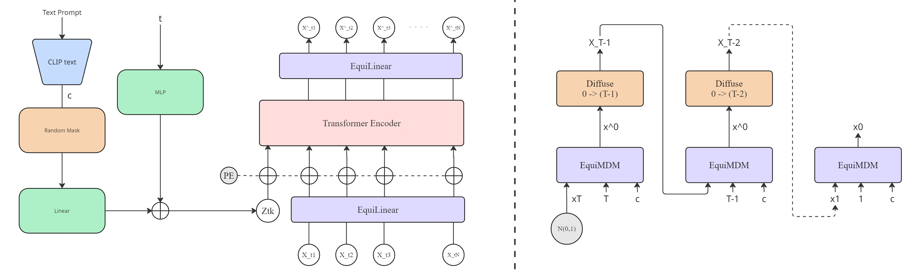
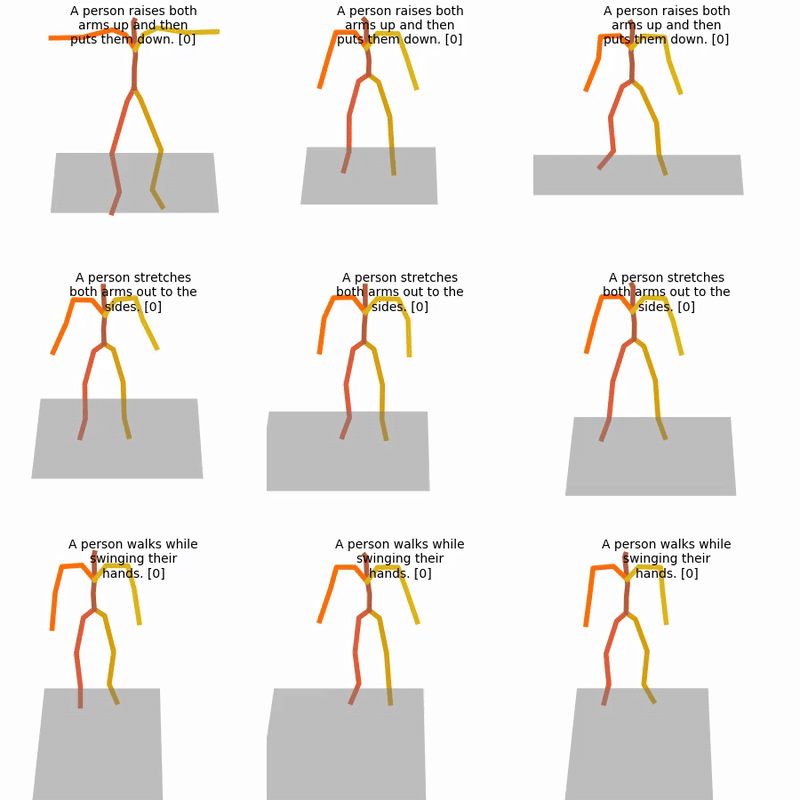
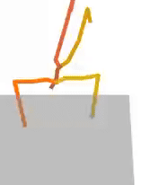
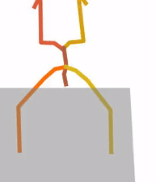
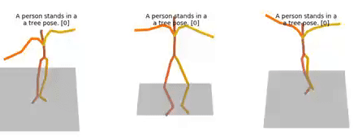
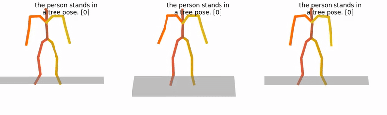

# Equivariant Diffusion Model for Text-Driven Human Motion Generation

This project explores enhancing text-guided Human Motion Generation (HMG) by incorporating **rotational and reflectional equivariance** into a diffusion-based architecture. We propose **Equi-MDM**, a modification of the baseline **Motion Diffusion Model (MDM)**, where standard linear layers are replaced with **Equivariant Linear (EquiLinear) layers** to preserve the symmetry and physical plausibility of generated human motions.

## Method Overview

Human motion often exhibits strong structural properties like **symmetry**, **periodicity**, and **limb coordination**. To better capture these patterns, we designed an **equivariant diffusion model** using **EquiLinear layers** that enforce **SO(3) symmetries** throughout the learning and generation process.

Our approach is structured as follows:
- Use **MDM** as the baseline.
- Replace its transformer encoder linear layers with **EquiLinear** layers (based on scalar irreducible representations).
- Train and evaluate on the **HumanML3D** dataset.

The core idea: ensure that **noise prediction functions** inherit equivariance from the expert policy, respecting rotations and reflections during generation.

## Model Architecture

  

> **Figure:** (Left) Overview of the Equivariant Motion Diffusion Model (EquiMDM). (Right) Sampling process illustrating denoising over steps.

---
## Quantitative Results

| Methods             | Matching Score ↑ | R-Precision@1 ↑ | R-Precision@2 ↑ | R-Precision@3 ↑ | FID ↓  | Diversity ↑ |
|:--------------------|:----------------:|:---------------:|:---------------:|:---------------:|:------:|:-----------:|
| T2M-GPT              | 3.505 ± 0.017     | 0.470 ± 0.003   | 0.659 ± 0.002   | 0.758 ± 0.002   | 0.335  | -           |
| MMM                  | 3.359 ± 0.009     | 0.487 ± 0.003   | 0.683 ± 0.002   | 0.782 ± 0.001   | 0.132  | -           |
| MoMask               | 3.353 ± 0.010     | 0.490 ± 0.004   | 0.687 ± 0.003   | 0.786 ± 0.003   | 0.116  | -           |
| MDM (50 steps)       | 3.640 ± 0.028     | 0.440 ± 0.007   | 0.636 ± 0.006   | 0.742 ± 0.004   | 0.518  | -           |
| MotionDiffuse        | 3.490 ± 0.023     | 0.450 ± 0.006   | 0.641 ± 0.005   | 0.753 ± 0.005   | 0.778  | -           |
| Ground Truth         | 3.238 ± 0.006     | 0.453 ± 0.003   | 0.657 ± 0.002   | 0.768 ± 0.002   | 0.001  | 9.264       |
| **Equi-MDM (500K)**  | **3.363 ± 0.024** | **0.435 ± 0.005** | **0.644 ± 0.006** | **0.758 ± 0.005** | **0.742** | **10.109** |

- **Equi-MDM** achieves comparable semantic alignment and diversity to state-of-the-art models.
- **Higher diversity** suggests better multi-modality generation.
- **FID improvement** at higher training steps indicates increased realism.

---
## Qualitative Results

- **Symmetric and realistic motion generation**.
- Improved naturalness for actions like **yoga poses**, **walking**, and **dancing**.
- Less frame-wise noise compared to baseline MDM.

  

> **Motion Sequences:** Symmetric motions generated for text prompts like "person performing tree pose" and "person walking straight then running."

### 📽️ [Video Demonstrations](https://drive.google.com/file/d/1Fr7BHyP2UNubiZE0L-a3Gdmn5OlCmONn/view?usp=sharing)

---
### 📽️ [Comparison with MDM](https://drive.google.com/file/d/1u8fjVtcjjZ-nJtC8bDzT-8AXV-xRCV2R/view?usp=sharing)
#### 🏊 Swim
- MDM:
  
- Equivariant:
  

#### 🌳 Tree Pose
- MDM:
  
- Equivariant:
  

---
## Conclusion

We demonstrated that embedding **equivariant inductive biases** into diffusion-based human motion generation models improves **symmetry**, **motion fidelity**, and **semantic alignment**. Future work will explore:
- Dynamic sequence length prediction.
- Extending equivariance to the **attention mechanisms**.
- Applying full symmetry handling (rotation, translation) across broader architectures.

---
## References

Please cite our project if you find this work helpful.

